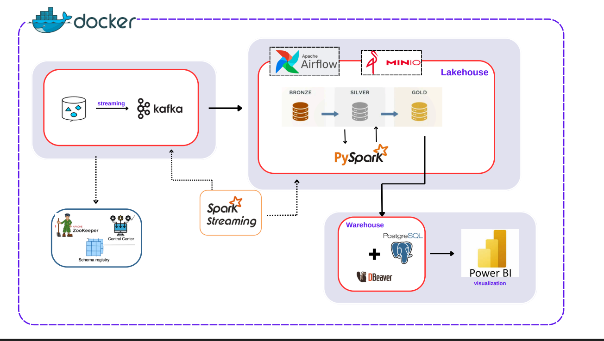
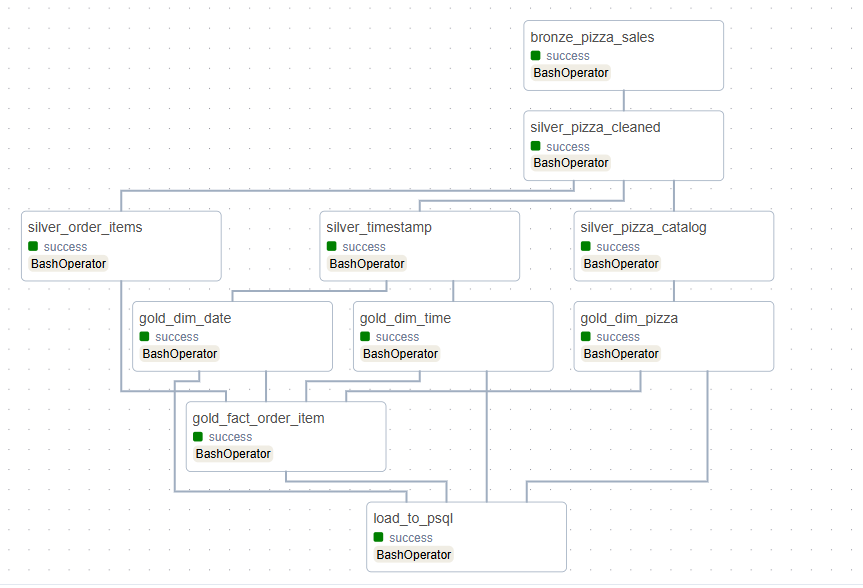
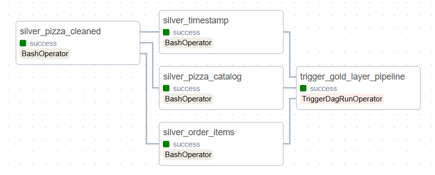
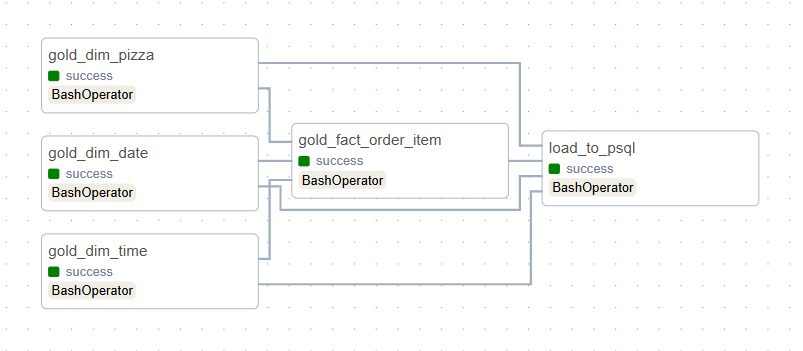
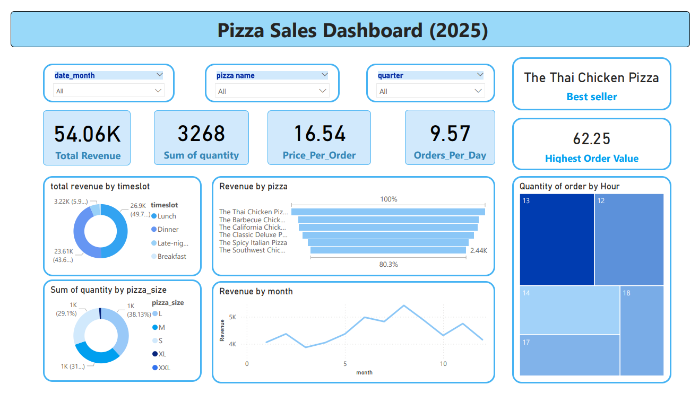

# Pizza Sales Streaming Pipeline

**💼 For more detail please visit this project in my personal portfolio site**
   [huyentranq.github.io](https://huyentranq.github.io/)

The Pizza Sales Streaming Pipeline is designed to showcase real-time data processing capabilities by simulating pizza restaurant sales data. The pipeline ingests streaming data through Apache Kafka, processes it using Apache Spark Streaming, stores raw and processed data in MinIO and PostgreSQL respectively, orchestrates workflows with Apache Airflow, and provides business insights through Power BI dashboards.


## 📋 Table of Contents

- [ Architecture](#️-architecture)
- [ Data Flow & Lineage](#-data-flow--lineage)
- [ Installation & Deployment](#-installation--deployment)
  - [Prerequisites](#prerequisites)
  - [Quick Start](#quick-start)
  - [🛠️ Makefile Commands](#makefile-commands)
- [ Power BI Dashboard ](#-power-bi-dashboard)
- [ Limitations & Future Improvements](#-limitations--future-improvements)
  - [Current Limitations](#current-limitations)
  - [How you can make it better](#how-you-can-make-it-better)
- [ Contributing](#️-contributing)

---


## 🏛️ Architecture



The pipeline follows a modern data architecture pattern with the following components:


- **Real-time Data Streaming**: Kafka producers simulate continuous pizza sales transactions
- **Stream Processing**: Spark Streaming processes data in near real-time
- **Medallion Architecture**: Implements Bronze, Silver, and Gold data layers
- **Data Lake Storage**: MinIO serves as the data lake for saving data from 3 layer
- **Data Warehouse**: PostgreSQL stores processed, analytics-ready data
- **Workflow Orchestration**: Airflow manages and schedules data pipelines
- **Business Intelligence**: Power BI dashboards for data visualization and insights
- **Containerized Deployment**: Docker-based setup for easy deployment and scalability


## 📊 Data Flow & Lineage





1. **Messages from Kafka**:  
   - Raw streaming data produced by upstream services  
   - Queued messages ready to be ingested into the Bronze layer
2. **Bronze Layer (Raw Data)**: 

   - Kafka topic `pizza_sales` receives raw streaming order data.
   - Data is parsed using a predefined schema and enriched with `ingest_time`.
   - Only one MinIO bucket (`lakehouse`) is used across all layers; no need to duplicate per layer.


3. **Silver Layer (Cleaned Data)**:

   - The raw data from the Bronze layer is cleaned, validated, and transformed into structured tables.
   - Includes deduplication and strict schema enforcement.
   - Data is enriched with additional calculated fields.

   - The resulting tables include:

      - **`silver_cleaned`**: cleaned data derived from bronze_pizza_sales.
      - **`silver_order_items`**: extracts detailed information about each order.
      - **`silver_pizza_catalog`**: extracts detailed information about each type of pizza.
      - **`silver_timestamp`**: extracts and computes additional time-related attributes.
   
4. **Gold Layer (Aggregated Data)**:


The **Gold Layer** contains aggregated and transformed data structured into dimensional models. Data is organized into **dimension tables** and **fact tables** for analytics and reporting.

 **Dimension Tables**

- **`gold_dim_date`**:  
  Derived from `silver_timestampt`.  
  Includes: `date_id`, `order_date`, `day`, `month`, `year`, `quarter`, `week_of_year`, `weekday_num`, `weekday_name`.  
  Supports time-based analysis across various intervals.

- **`gold_dim_time`**:  
  Also derived from `silver_timestampt`.  
  Helps analyze customer behavior by specific time periods (e.g., hour of day).

- **`gold_dim_pizza`**:  
  Contains detailed information on each pizza, built from `silver_pizza_catalog`.  
  Includes a synthetic key `pizza_sk` for joining with fact tables.

**Fact Tables**

- **`gold_fact_order_item`**:  
  The main fact table capturing item-level order details.  
  Created by joining `silver_order_items` with dimension tables `gold_dim_date`, `gold_dim_time`, and `gold_dim_pizza` using foreign keys.

--- 

## 🚀 Installation & Deployment

### Prerequisites

   - Docker Desktop
   - 8GB+ RAM recommended
   - python 3.8
   - Power BI Desktop
### Quick Start

1. **Clone the repository**
   ```bash
   git clone https://github.com/huyentranq/Streaming-Data-pipeline.git
   cd Streaming-Data-pipeline
   ```

2. **Set up environment variables**
   ```bash
   # Edit .env file with your configuration
   ```

3. **Initialize all container**

   ```bash
   #note: run one by one
   make install 
   make build_stream
   make up_stream
   make up

   ```
   **Port Mappings & Service Access**

      | Service | Port | URL | Description |
      |---------|------|-----|-------------|
      | Apache Airflow | 8080 | http://localhost:8080 | Workflow orchestration UI |
      | Kafka UI | 8081 | http://localhost:8081 | Kafka cluster management |
      | MinIO Console | 9001 | http://localhost:9000 | Data lake management |
      | PostgreSQL | 5432 | http://localhost:5432 | Data warehouse |

4. **Start kafka streaming**
   ```bash
   make kafka_stream
   ```
   Visit http://localhost:8081 to monitor messages streamed from the producer.
5. **Initialize the data warehouse**
   ```bash
   make psql_create
   ```
   - Connect PostgreSQL to DBeaver (desktop app) for managing the database with a graphical interface.
6. **Launch Airflow to Manage DAGs**
   http://localhost:8080

   From there, you can view, trigger, and monitor all available DAGs


### Makefile Commands
`Makefile` to simplify setup, deployment, and testing. Below is a summary of the available commands:

| Command               | Description                                                      |
|-----------------------|------------------------------------------------------------------|
| `make install`        | Install Python dependencies from `requirements.txt`              |
| `make up`             | Start all services defined in `docker-compose.yml`              |
| `make down`           | Stop and remove all core services                                |
| `make up_stream`      | Start streaming services (Kafka, Spark Streaming, etc.)          |
| `make down_stream`    | Stop and remove streaming services and volumes                   |
| `make kafka_stream`   | Run the Kafka producer to stream data into Kafka topic           |
| `make test_bronze`    | Run the Bronze Layer Spark job (`kafka_to_bronze.py`)            |
| `make test_silver`    | Run the Silver Layer Spark job (`silver_layer.py`)               |
| `make test_gold`      | Run the Gold Layer Spark job (`gold_layer.py`)                   |
| `make test_warehouse` | Load final data into the PostgreSQL warehouse (`warehouse.py`)   |
| `make to_psql`        | Connect to the PostgreSQL database (using variables from `.env`) |
| `make to_psql_no_db`  | Connect to the PostgreSQL server without selecting a database     |
| `make psql_create`    | Initialize PostgreSQL schema using `/tmp/load_dataset/psql_schema.sql` |

> 💡 **Tip:** Ensure your `.env` file is correctly configured before executing any command.

---

## Power BI Dashboard 
   

**Key Features**:
   - **Revenue Analytics**: Total revenue by time, pizza type, and order channel.
   - **Best Seller Insights**: Top-selling pizzas and categories.
   - **Operational Metrics**: Number of orders, average order value, and peak order hours.
   - **Dynamic Filtering**: Slicers allow filtering by date, pizza category, and order source.

   [You can download my dashboard here](images/dashboard.pbix)
   **Access the Dashboard**:
      - Make sure the PostgreSQL connection is properly configured in Power BI (check credentials and host settings).
      - Use Power BI Desktop to open and interact with the report.

   **Build your own dashboard**
## 🚧 Limitations & Future Improvements

### Current Limitations

1. **Scalability**: Single-node setup limits processing capacity
3. **Error Handling**: Basic error handling and retry mechanisms
4. **Security**: Default credentials and minimal security configuration
5. **Monitoring**: Limited observability and alerting capabilities

### How you can make it better

1. **Enhanced Scalability**
   - Multi-node Kafka and Spark clusters
   - Kubernetes deployment for auto-scaling
   - Partitioning strategies for large datasets


2. **Data Quality & Governance**
   - Data lineage tracking
   - Automated data profiling and validation

3. **Integerate CI/CD**
   - logic testing
   - schema validation

## 🤝 Contributing

1. Fork the repository
2. Create a feature branch (`git checkout -b feature/amazing-feature`)
3. Commit your changes (`git commit -m 'Add some amazing feature'`)
4. Push to the branch (`git push origin feature/amazing-feature`)
5. Open a Pull Request


---

**Happy coding!**